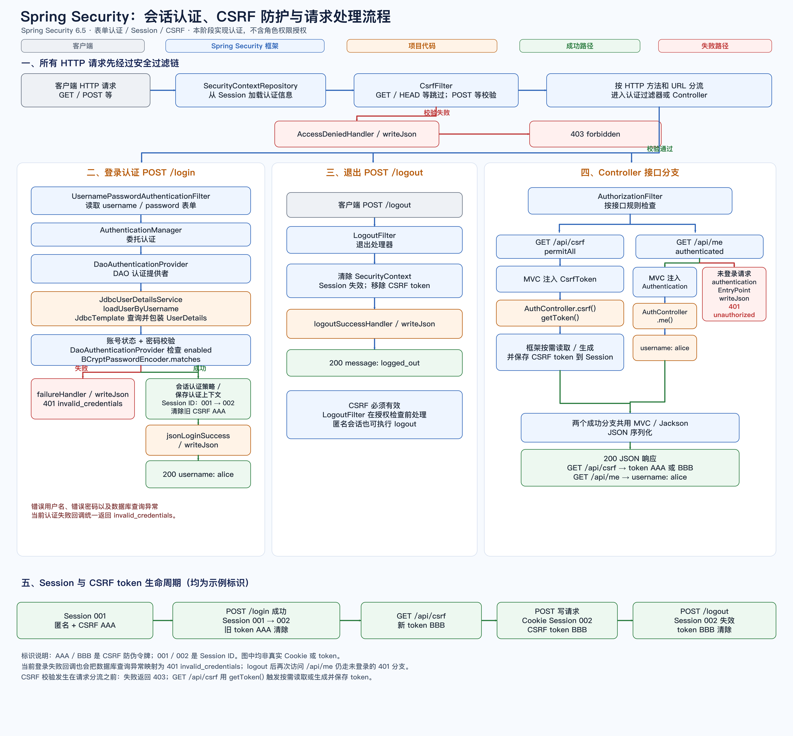

# RBAC 与 MySQL 学习项目（阶段六）

项目使用 Java 17、Spring Boot 3.5.15、Spring Security 6.5、JDBC 和 MySQL 8.4，展示 RBAC 七张核心表、关联约束和手动 JOIN。当前已包含基于数据库用户表的表单登录、Session、CSRF、用户 API 权限控制、当前用户菜单查询，以及适用于本地独立学习、允许匿名请求的 A→B 事务演示。菜单只表示导航数据，不能代替 API 权限检查。阶段说明见 [阶段三](docs/stage-3/README.md)、[阶段四第一步](docs/stage-4/README.md)、[阶段五第一步](docs/stage-5/README.md) 和 [阶段六：MySQL 索引与执行计划](docs/stage-6/README.md)。

图中灰色表示客户端、蓝色表示 Spring Security 框架、橙色表示项目代码、绿色表示成功路径、红色表示失败路径。点击图片可打开原尺寸图。

[](docs/assets/spring-security-session-csrf-flow.png)

## 环境与启动

需要 Docker Desktop、Docker Compose、Maven 3.9+ 和 JDK 17。首次在新环境运行时，若 `.env` 不存在，将 `.env.example` 复制为 `.env`，为 MySQL 和 root 设置不同的本地密码，并保证 `SPRING_DATASOURCE_PASSWORD` 与 `MYSQL_PASSWORD` 一致。不要覆盖已有的本机 `.env`；它已被 Git 忽略。Compose 使用 `mysql:8.4`，将 `127.0.0.1:3307` 映射至容器 `3306`，首次初始化空数据卷时执行 `db/schema.sql` 和 `db/seed.sql`。

```sh
docker compose --env-file .env up -d
docker compose ps
```

在 IntelliJ IDEA 中，为项目选择 JDK 17，并在 Spring Boot 运行配置的 Environment variables 中填写本机配置：

```text
SPRING_DATASOURCE_URL=jdbc:mysql://127.0.0.1:3307/rbac_mysql_demo?useSSL=false&allowPublicKeyRetrieval=true&serverTimezone=Asia/Shanghai;SPRING_DATASOURCE_USERNAME=piggy;SPRING_DATASOURCE_PASSWORD=YOUR_LOCAL_DB_PASSWORD
```

将占位值替换为本机 `.env` 中的 `SPRING_DATASOURCE_PASSWORD`，不要把密码提交到项目文件。IDEA 不会自动读取 `.env`。

也可在终端通过已安装的 JDK 17 和 Maven 构建、运行。先将 `JAVA_HOME` 指向本机 JDK 17 安装目录（以下为路径格式示例）：

```sh
export JAVA_HOME="/path/to/jdk-17"
export PATH="$JAVA_HOME/bin:$PATH"
export SPRING_DATASOURCE_URL='jdbc:mysql://127.0.0.1:3307/rbac_mysql_demo?useSSL=false&allowPublicKeyRetrieval=true&serverTimezone=Asia/Shanghai'
export SPRING_DATASOURCE_USERNAME='piggy'
export SPRING_DATASOURCE_PASSWORD='YOUR_LOCAL_DB_PASSWORD'
mvn package
java -jar target/rbac-mysql-demo-0.1.0-SNAPSHOT.jar
```

这里的环境变量必须在启动 Maven 或 Java 的 shell 中显式导出；Docker Compose 读取 `.env` 不会让独立的 Java 进程继承这些值。应用监听 `127.0.0.1:8082`。启动后先请求 <http://127.0.0.1:8082/api/csrf> 获取 CSRF token，再以 `alice` 或 `bob` 登录；登录后访问 <http://127.0.0.1:8082/api/db-check> 查看连通性和七表计数。接口操作步骤见阶段2说明。

## 数据库学习与人工验证

应用账号为 `piggy`，演示用户为 `alice` 和 `bob`，分别关联 `admin` 与 `reader` 角色。两位演示用户的登录密码均为 `960225`；数据库只保存 BCrypt 哈希。该密码仅用于本地学习，不可用于真实服务。演示用户登录密码与 MySQL 连接账号 `piggy` 的 `.env` 密码用途不同；本机示例中两者取值恰好相同。Navicat Premium Lite 可连接 `127.0.0.1:3307` 的 `rbac_mysql_demo`，密码查看本机 `.env`。

在 Navicat 中运行 `db/verification.sql` 可查看用户→角色→权限和用户→角色→菜单 JOIN，并演示重复关系的 1062 复合主键错误及不存在外键目标的 1452 错误；失败操作后执行 `ROLLBACK`。用户已确认两种错误和回滚结果。SQL 初始化只在空数据卷首次启动时自动运行；已初始化数据库需要手动执行脚本，执行 `seed.sql` 前先执行 `schema.sql`。重复播种会补齐缺失的演示关联，不覆盖已有字段。`GET /api/menus` 每次请求从数据库读取当前用户菜单；阶段四第一步的手动 Postman 检查待执行，详见阶段说明。

MySQL 容器停止后数据仍保留：

```sh
docker compose stop
```

## 仓库约定

每个阶段在 `docs/stage-N/README.md` 维护一份阶段说明，每次提交至少更新相关阶段 README。`scripts/` 和 `src/test/` 仅供本机使用，不纳入版本控制；阶段验收结论汇总到对应 README。
